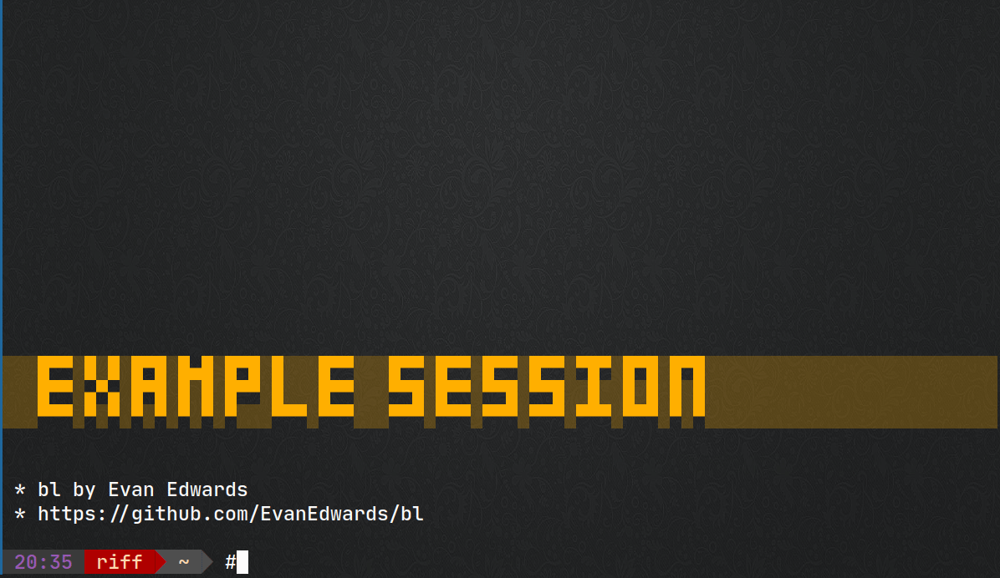

# bl

`bl [CMD [CMD]...]`

A simple script to quickly manage a blacklist line in /etc/hosts.


# Demonstration




# Installation

1. Copy `src/bl` to some place like `$HOME/.local/bin`
2. Add the following two lines to `/etc/hosts`:

```
#!bl key:domain key2:domain2
127.0.130.1 blacklisted
```

The #!bl line lists a set of key:value pairs that are used on the command line.  For instance, `fb:facebook.com` allows you to blacklist facebook.com and www.facebook.com with `bl fb` and then remove it with `bl -fb`.   You can always directly add or remove a full domain with `@` or `^`.

Optional: The file and ip address can be altered by editing the script.


# Operations

```
  key     - Same as +key
  +key    - Add domain corresponding to available key
  -key    - Remove domain corresponding to available key
  @domain - Add domain
  ^domain - Remove domain
```


# TODO

- [ ] Clear all
- [ ] Groups?  Personally I use bash aliases for groups of domains, so there is no built in option for a group of domains.


# Legal

Copyright 2024 Evan Edwards <evan@cheshirehall.net>

Released under an open source MIT License.  See LICENSE for details.
